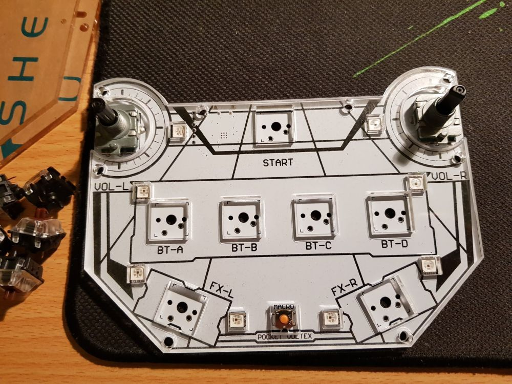
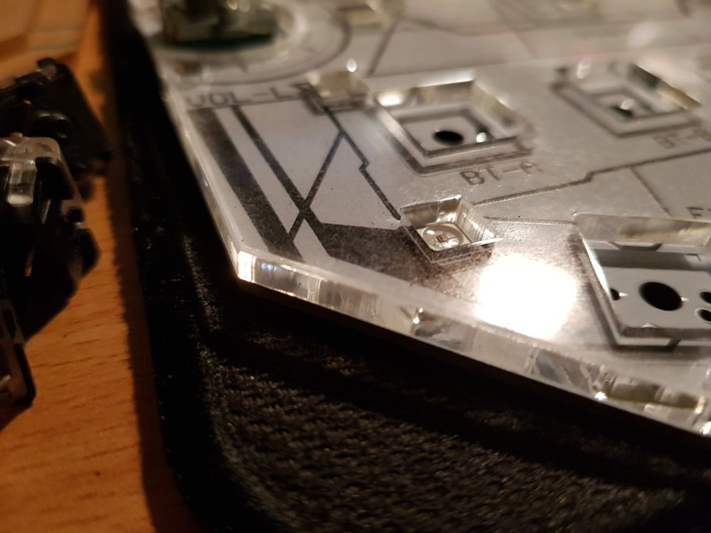
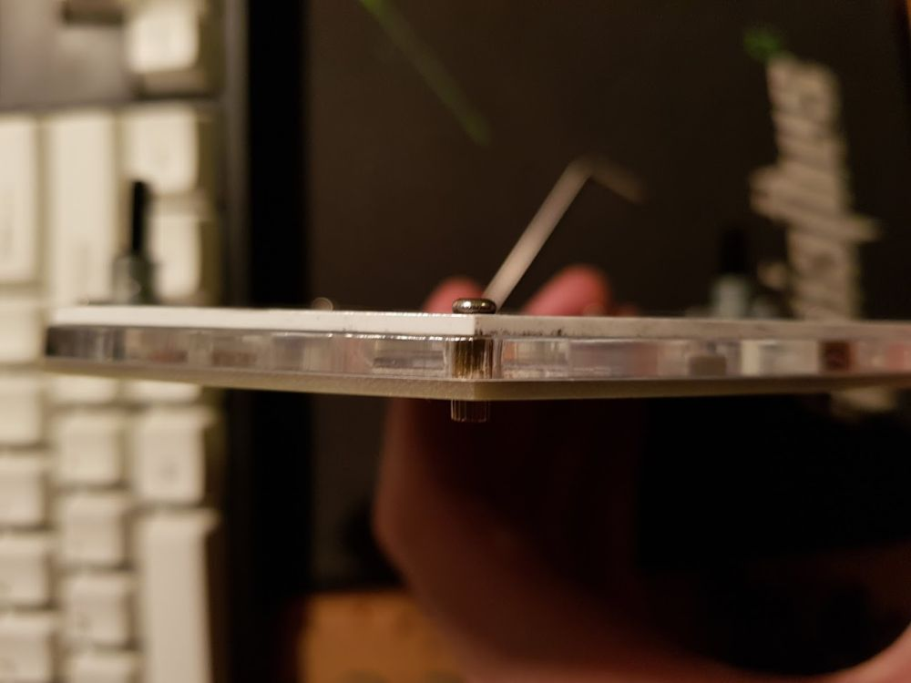
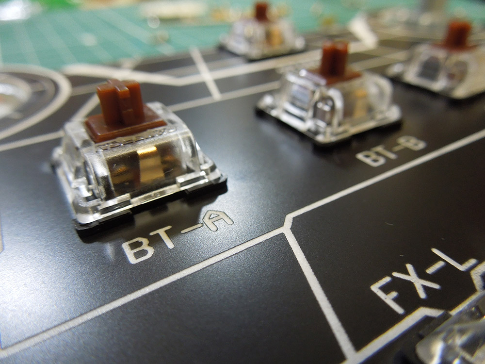
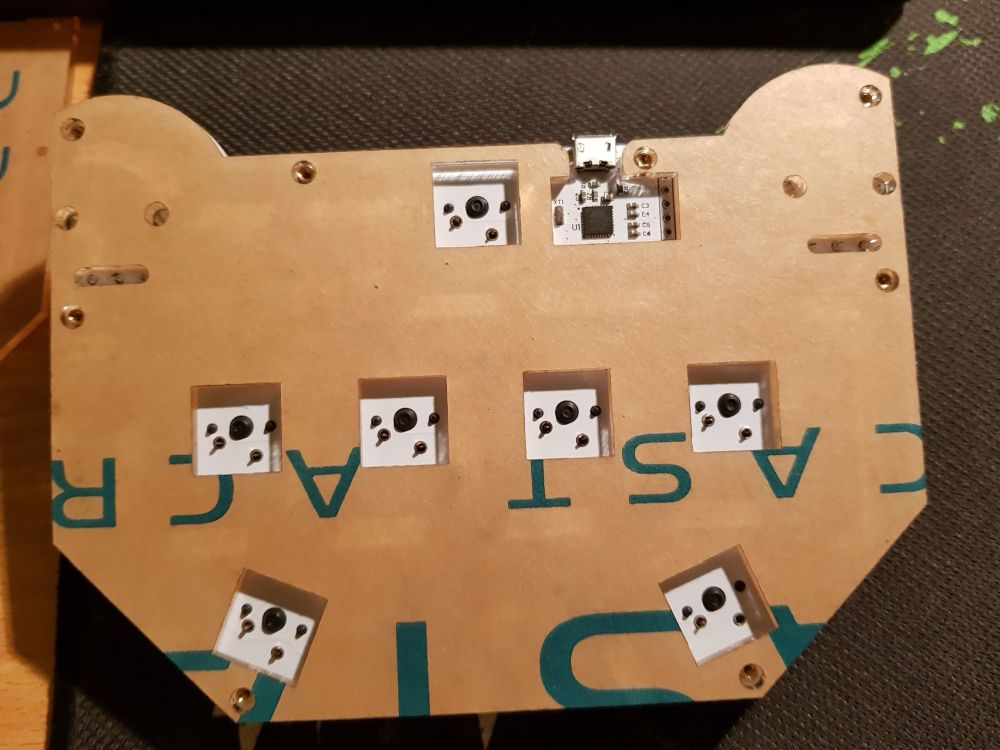
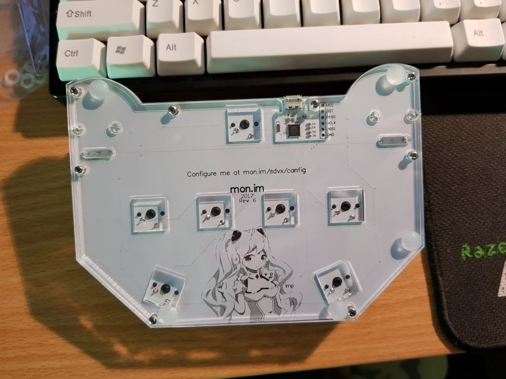

# Assembly

Run through this guide once before building, ensuring you have all the parts required. You'll also need a soldering iron and solder.

## Acrylic
**STOP NOW!** I *know* it's tempting, but don't peel off the protective backing from all the acrylic yet.
Once it's off, the pieces attract dust, which can make the rear look messy.

**WARNING:** The top 2 plates (those with encoder holes) are fragile and easily snap if dropped. Take care when assembling. Once assembled, they are protected by the rest of the controller and should not break.

Take off the protective backing from the top clear acrylic.
Take your top clear plate and top black plate and place them over the LEDs. Take note of the clear plate - it has engraved edges for optimal lighting. It can be installed with the edges up or down, but they look best when facing up.

Use the 1.5mm Allen key provided to screw the board together.
Insert the top 8 bolts and 8 long nuts into the holes provided.

## Switches
Insert all your switches, and make sure they are seated properly. They are meant to be a tight fit into the PCB and should be completely flush with the surface.

Solder the switches. I solder with the back plate on, with its protective backing. This prevents flux from splashing over your board.

## Nuts and bolts
Stack the bottom 2 plates after removing their protective backing and insert the remaining 8 bolts.
Take care to align the cutout over the USB port.
Attach your 6 adhesive rubber feet. You can place these anywhere, but here is where I put them:

# Final touches
Using the Allen key provided, attach the knobs. The encoder shaft is shaped like a D - ensure you tighten the grub screw on the flat part of the D.

*Optional:* Add 7 o-rings to your keycaps to make them quieter.

Install keycaps by simply pushing them onto the switches.

