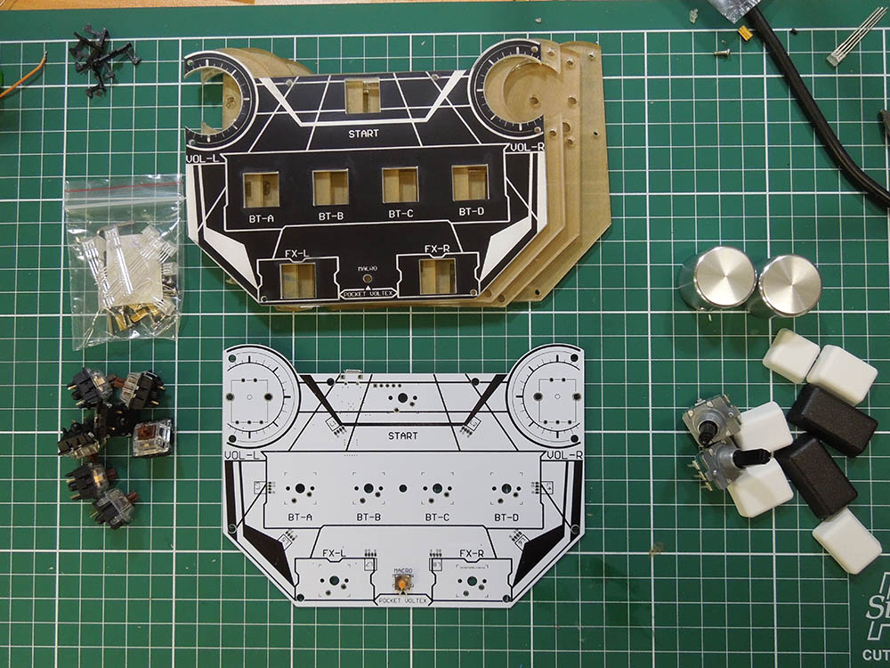
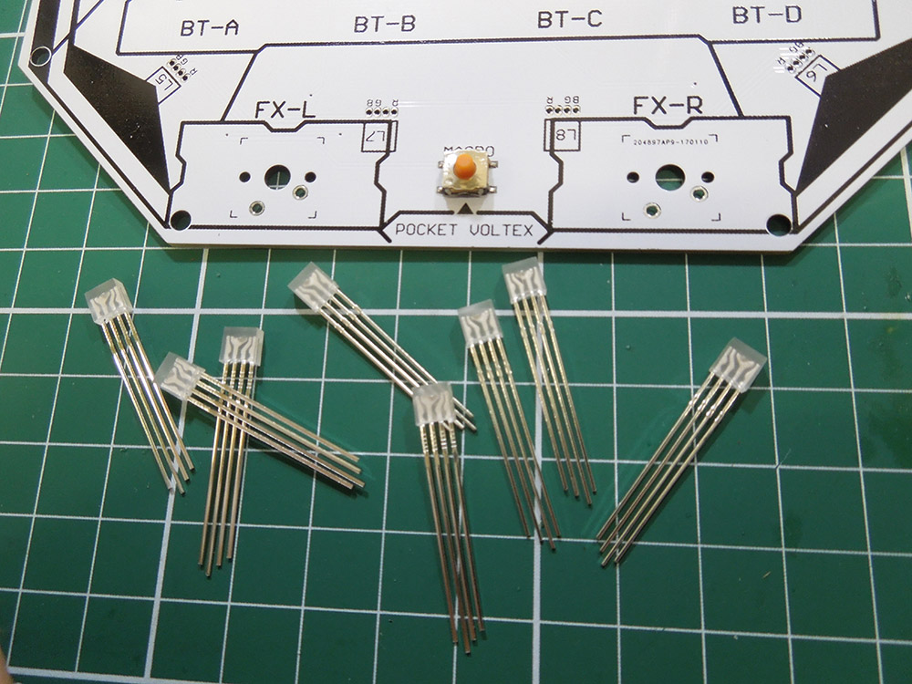
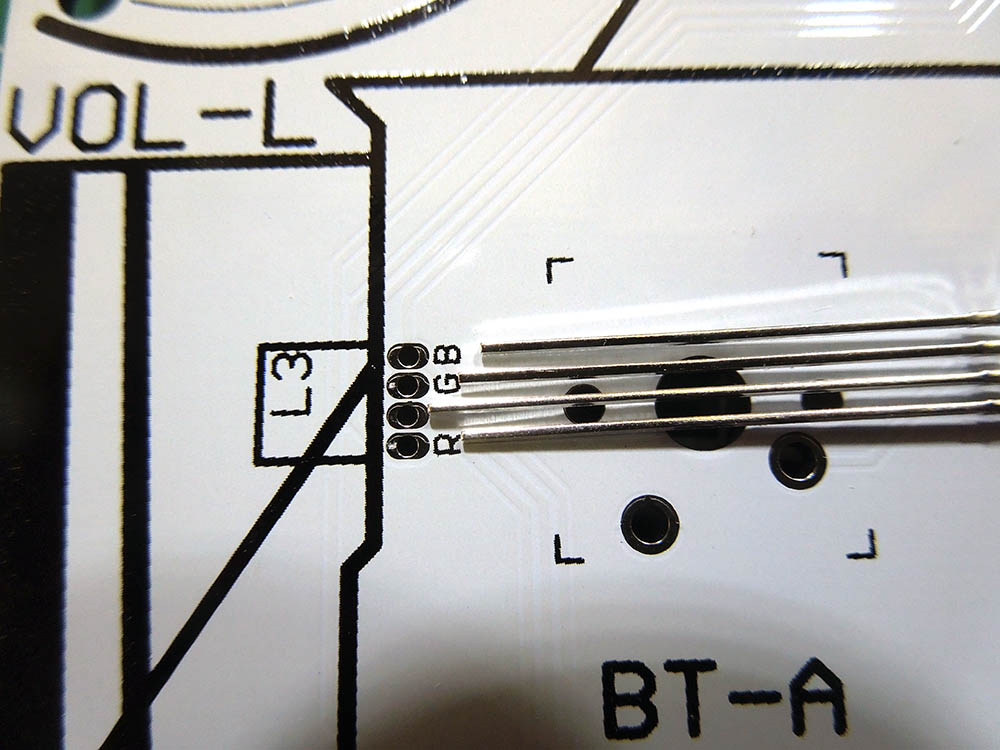
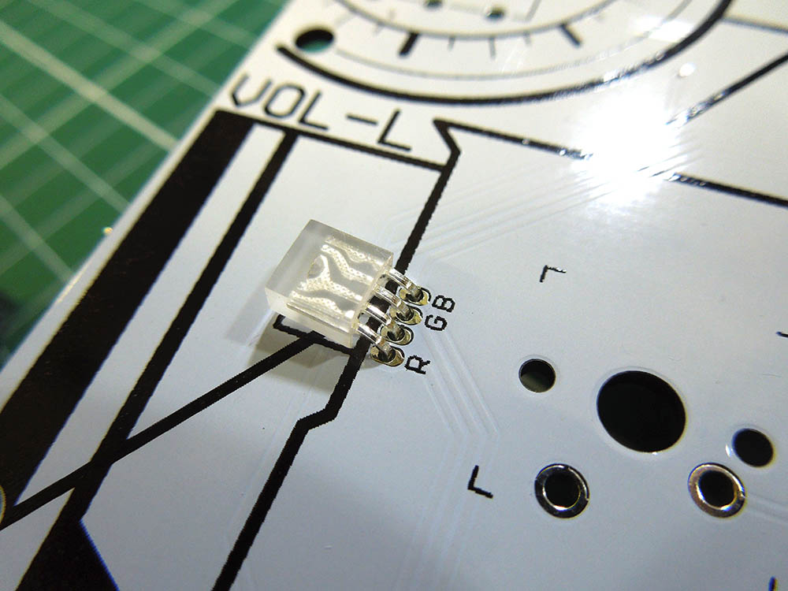
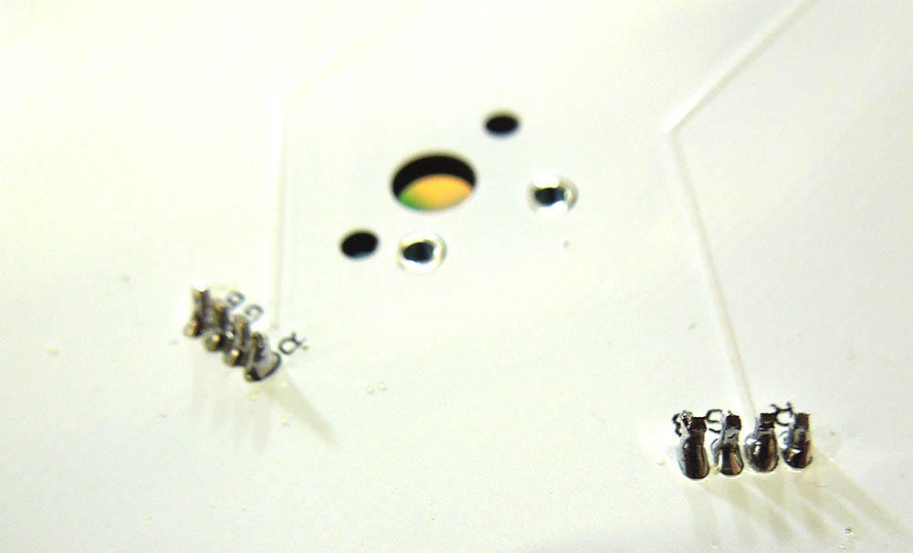
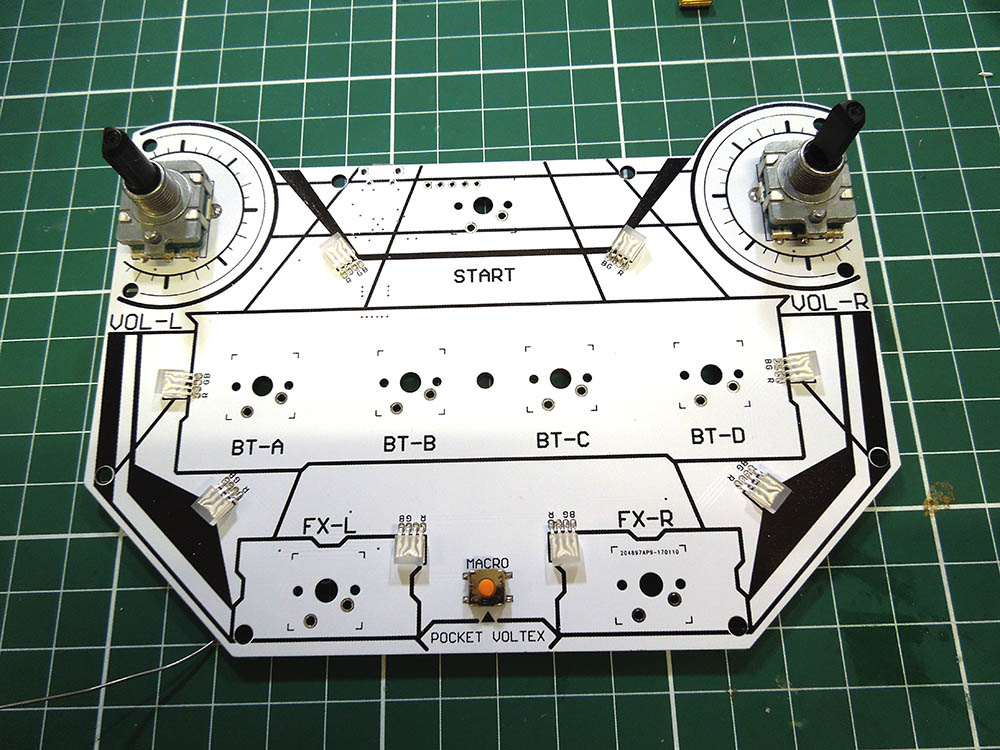
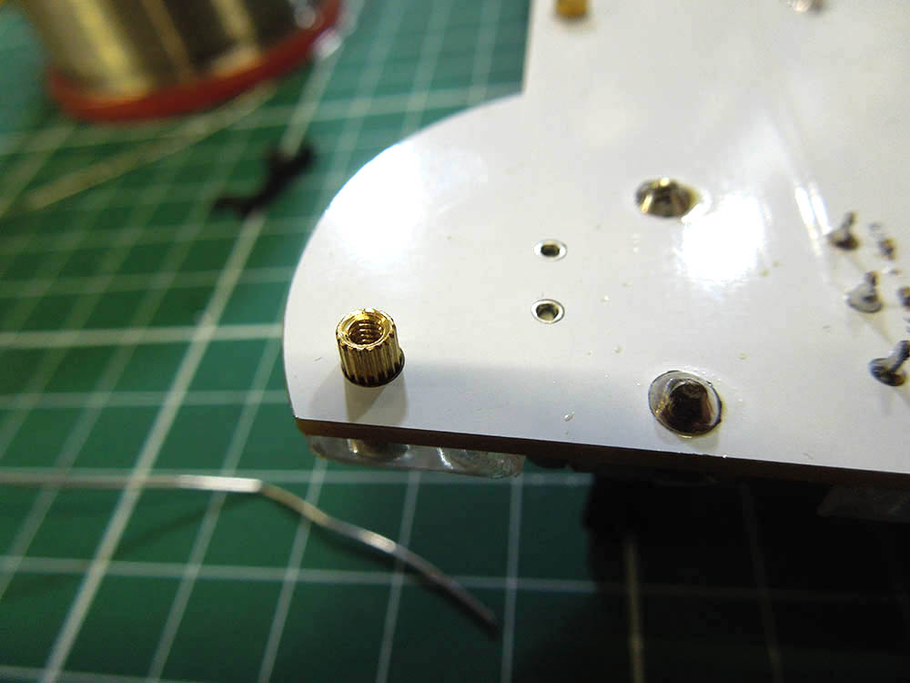
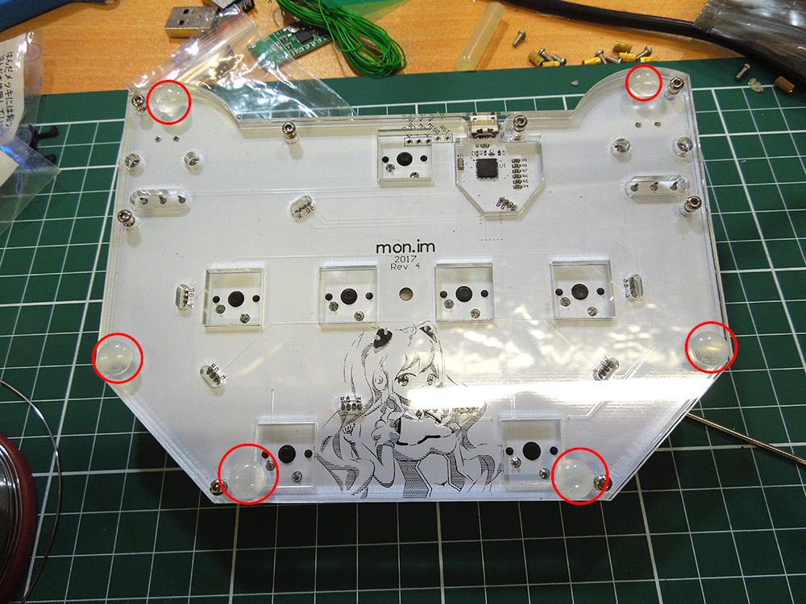

# Assembly

Run through this guide once before building, ensuring you have all the parts required. You'll also need a soldering iron and solder.

## LEDs
First up, the LEDs.

Take note, each LED point on the board has labelled connections for R, G and B. The long leg on the LEDs goes into the unmarked (ground) hole.

Insert the LEDs roughly to the red line, then bend them over:

Work on a slightly raised surface and place the board face down to solder, with the MACRO switch off the edge. This ensures all the LEDs are flush with the board surface.

I recommend soldering one leg of each LED to keep it in place, then cutting off all the leads. This makes soldering the rest of the connections much easier.

The bend doesn't have to be perfect - the acrylic will diffuse the light.

## Encoders
You can solder the encoders now or after you install the switches, but I prefer to do them sooner. Solder one of the small pins to keep it in place then pump lots of solder into the big connecting lugs. These need to take your abuse, so make it a good joint!

## Switches
**STOP NOW!** Have you finished soldering your LEDs? Have you tested them?
Once you have soldered the switches you cannot fix anything without desoldering
them again.

**WARNING:** The top 2 plates (those with encoder holes) are fragile and easily snap if dropped. Take care when assembling. Once assembled, they are protected by the rest of the controller and are much stronger.

Take your top clear plate and top black plate and place them over the LEDs. Take note of the clear plate - it has engraved edges for optimal lighting. It can be installed with the edges up or down, but they look best when facing up.

Insert all your switches, and make sure they are seated properly. They are meant to be a tight fit into the PCB and should be completely flush with the surface.

## Nuts and bolts
Use the 1.5mm Allen key provided to screw the board together.
Insert the top 8 bolts and 8 long nuts into the holes provided. Take note, there are 3 holes in the PCB that are unused. These nuts can sometimes be a tight fit - you may need to push them into the case with a hard surface.

Stack the bottom 2 plates and insert the remaining 8 bolts. Take care to align the cutout over the USB port. The bolts are a fraction too short, you may need to back off the top bolts by about 2 turns to get the nut close enough.

## Rubber feet
Attach your 6 adhesive rubber feet. You can place these anywhere, but here is where I put them:

# Final touches
Using the Allen key provided, attach the knobs. The encoder shaft is shaped like a D - ensure you tighten the grub screw on the flat part of the D.

*Optional:* Add 7 o-rings to your keycaps.

Install keycaps by simply pushing them onto the switches.

