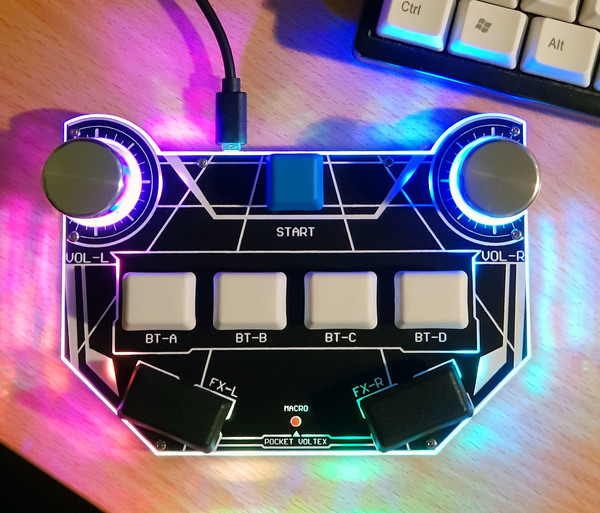

# Pocket Voltex

A tiny controller for K-Shoot MANIA/Sound Voltex or other similar games

## Project status
There is a major revision coming sometime 2021 but I estimate requires 50+ hours
to complete design. It will significantly improve manufacturing efficiency and hopefully
allow me to sell controllers while working full-time.

Please don't hold your breath on a timely release, but I have not forgotten this
project.

## Documentation
[DIY Kit assembly](Docs/Assembly.md)  
[(Old version)DIY Kit assembly](Docs/Assembly_old.md)

[Controller configuration](Docs/Configuration.md)

## Features
* Gateron mechanical switches
* Rock solid Bourns encoders with hardware smoothing
* 8 RGB LEDs
* Beautiful laser cut acrylic case
* Custom aluminium knobs by DJ Dao
* Acts as a gamepad or keyboard/mouse (KSM)
* HID Lighting support
* Configurable card/pin macro key
* Chrome configurator
* No drivers required!
